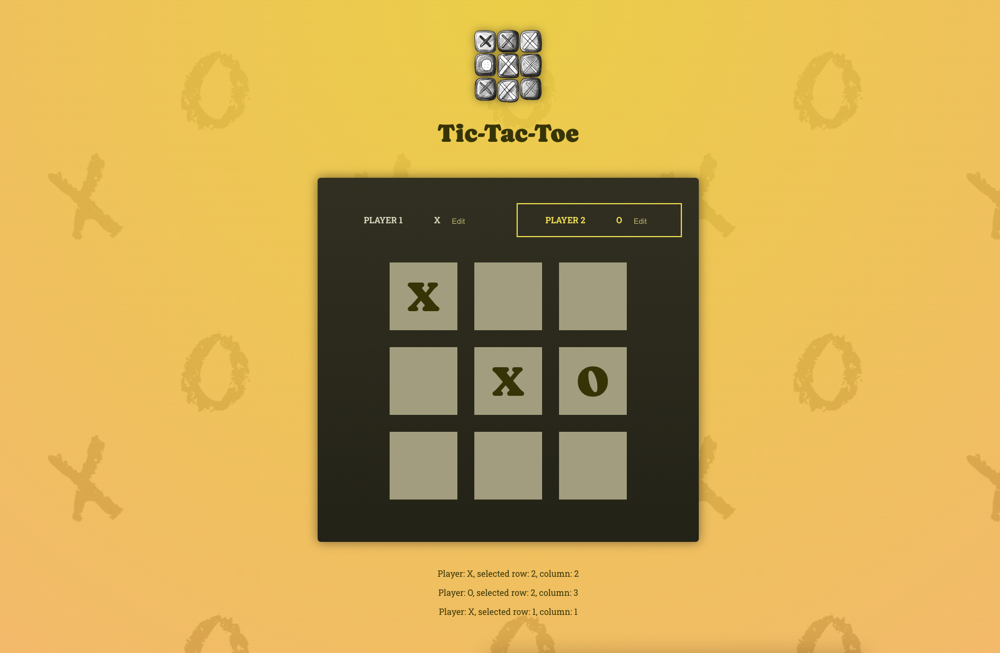
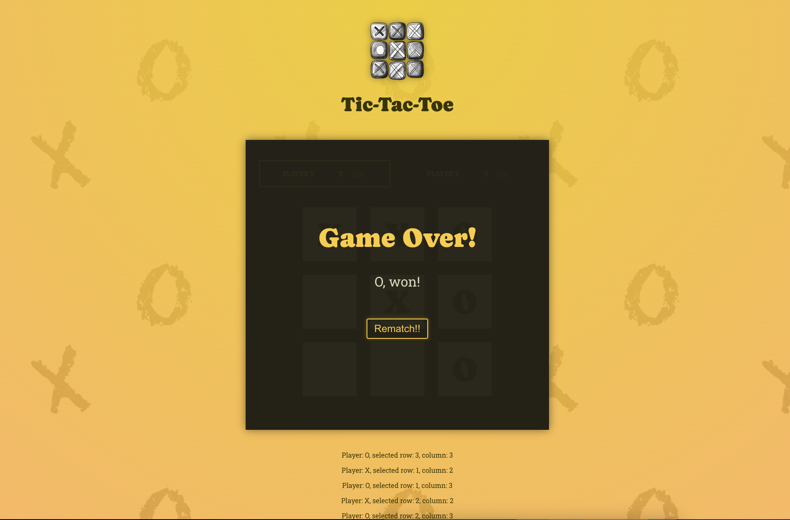

# Tic-Tac-Toe Game



A simple Tic-Tac-Toe game built with React, TypeScript, HTML5, and CSS3. This project follows best practices for React and TypeScript to ensure a clean and maintainable codebase.

## Features

- Classic Tic-Tac-Toe gameplay.
- Responsive design, works on mobile and desktop.
- Minimal and elegant UI.
- Built using React's functional components and hooks.
- Written in TypeScript for better type safety and developer experience.

## Screenshots

### Game in process


### Game Over


## Installation

To run the game locally, follow these steps:

1. Clone the repository:
    ```sh
    git clone https://github.com/letStayFoolish/react-essentials-game
    ```

2. Navigate to the project directory:
    ```sh
    ...
    ```

3. Install the dependencies:
    ```sh
    npm install
    ```

4. Start the development server:
    ```sh
    npm start
    ```

5. Open your browser and go to `http://localhost:5173/` to see the game in action.

## Folder Structure

Here is a brief overview of the project structure:

```plaintext
section-4-game/
├── public/
│   ├── bg-pattern.png
│   ├── bg-pattern-dark.png
│   └── game-logo.tsx
├── src/
│   ├── assets/
│   │   └── images/...
│   ├── components/
│   │   ├── GameBoard.tsx
│   │   ├── GameOver.tsx
│   │   ├── GameOver.tsx
│   │   ├── Log.tsx
│   │   └── Player.tsx
│   ├── constants/
│   ├── hooks/
│   ├── types/
│   ├── utils/
│   ├── App.tsx
│   ├── index.tsx
│   └── main.tsx
├── index.html
├── .gitignore
├── package.json
├── tsconfig.json
├── README.md
└── ...
```

## Technologies Used

- **React**: Library for building user interfaces.
- **TypeScript**: Typed superset of JavaScript that compiles to plain JavaScript.
- **HTML5**: Markup language used for structuring and presenting content on the web.
- **CSS3**: Style sheet language used for describing the presentation of a document written in HTML.

## Contributing

Contributions are welcome! If you have any ideas, suggestions, or issues, feel free to create a pull request or file an issue.

## License

This project is licensed under the MIT License.
---

Enjoy playing Tic-Tac-Toe!
